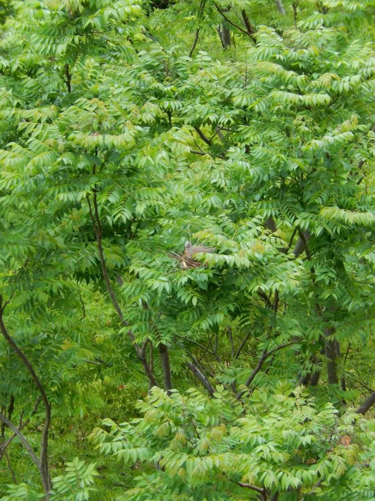
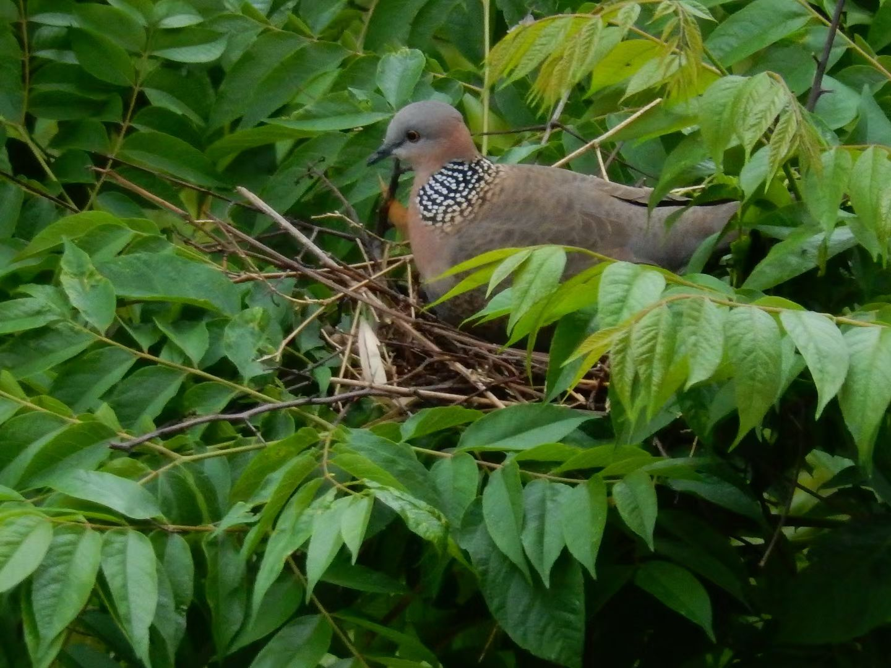
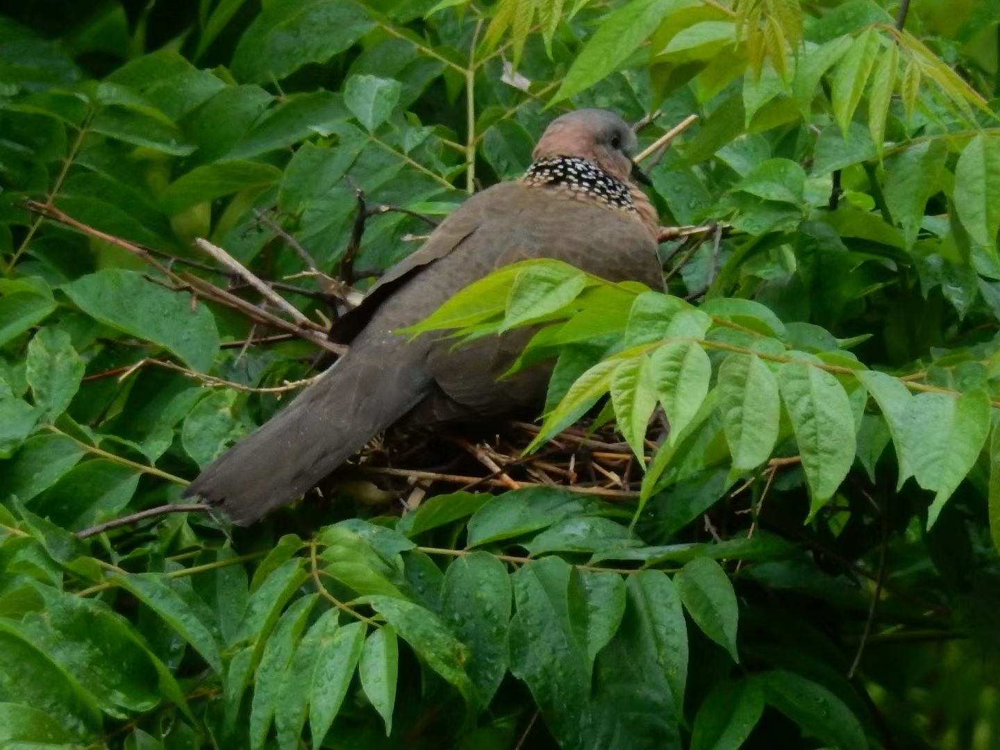
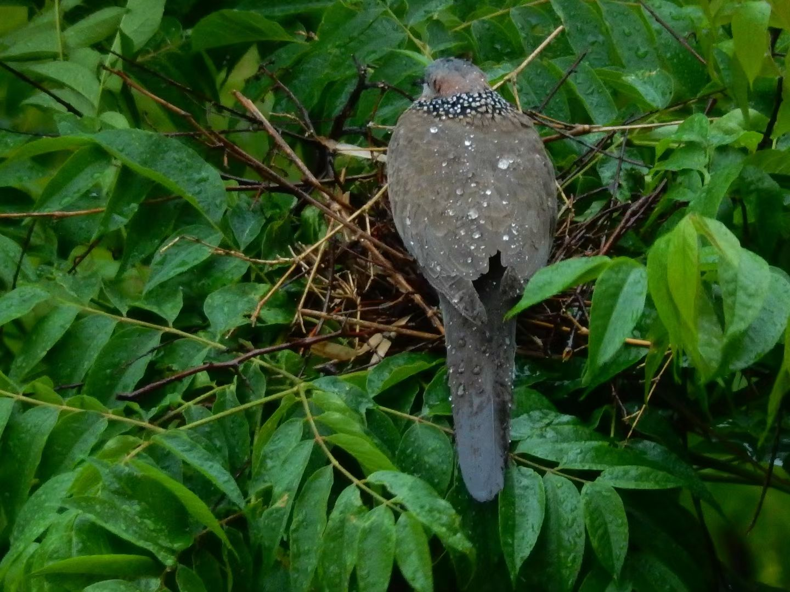

- 楼下的斑鸠在风雨中孵蛋坚持了好几天，但是昨天风很大，它的蛋应该是没有保护好。它也弃巢离开了。
本来是希望看到它孵出小鸟的
{width: 40%}
{width: 40%}
{width: 40%}
{width: 40%}

- 今晚看到我们小区被转成管控区了。意味着可以在小区里跑跑步了。封了一个多月，倒也没觉得什么。不过能出去跑跑步想起来也是一件惬意的事情。

---

昨天和今天尝试 Github Pages 几个简单的主题，搞到很晚。现在已经是凌晨了。
已经集中精力搞了两天。后面熟悉了，就不在主题上下功夫了，而是注入内容了

- jeklly/minimal 我把它的content width调宽了，看着比较舒服了。但是发现 ``语法以及image调整宽度似乎不起作用。 

- jeklly/minima 算是熟悉了一些。_posts的 link 用起来要小心点

这是我以后经常用的两个主题了

## :tada: 这是我的第一篇dailynote在github pages上!

