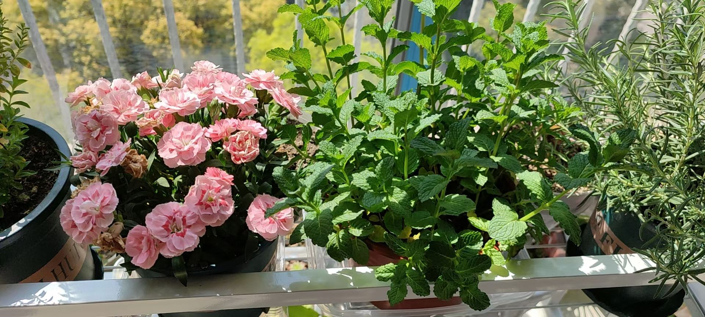
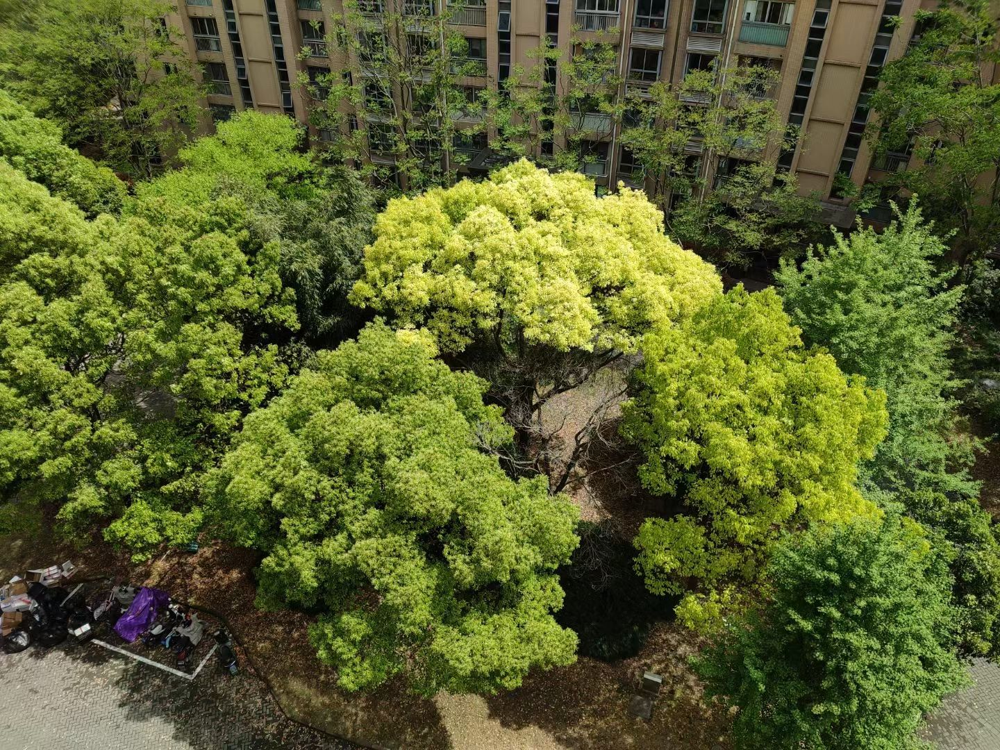
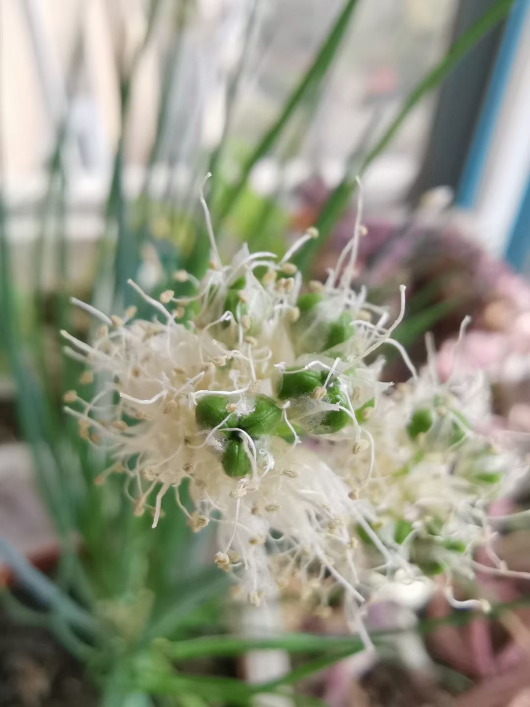

{: width="600"}
- 吃过早饭，在阳台揪了一片薄荷叶子吃，看似粗壮，没想到很嫩，入口即化，满嘴清香。以后多养几盆

<!-- {: width="300"} -->

{: width="300"}

- 樟树一年四季常绿，但颜色是变化的。冬天是深绿色，到了春天会重新落叶发出嫩叶来。刚发芽的是黄绿的，比如中间这一棵，然后变成嫩绿色，旁边的几棵树。

{: width="300"}
{: width="300"}

- 阳台养的葱开了花，最后还结了种子

- 疫情刚开始的时候，订外卖还是很方便的。这是一个月前叫的一份汉堡外卖，味道挺不错。

---

[⏮ home](../index.md) &nbsp; &nbsp; &nbsp; &nbsp; [🔀 category](../category.md) &nbsp; &nbsp; &nbsp; &nbsp; [◀️ prev](2022-04-29-mpe-inline-code.md) &nbsp; &nbsp; &nbsp; &nbsp; [▶️ next]()

---

