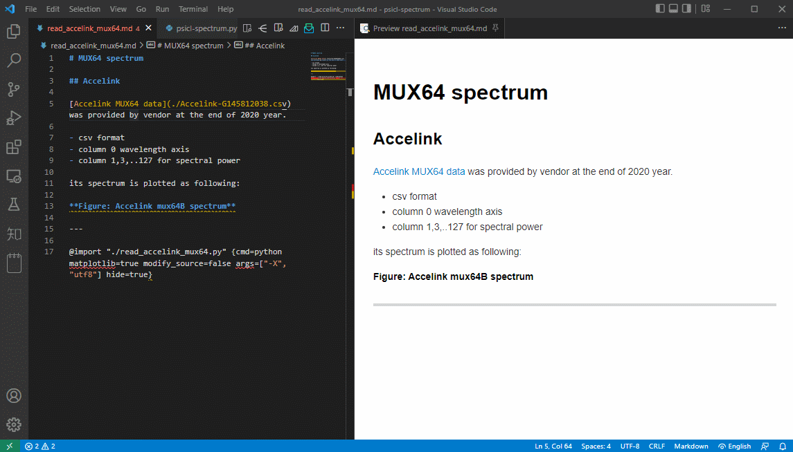

我没有用过 [jupyter](https://pypi.org/project/jupyter/), 但看过它和文本一起做coding并把输出结果输出在文档里，这种coding和documentation同时进行，感觉很有意思。

当我采用MPE([markdown preview enhanced](https://shd101wyy.github.io/markdown-preview-enhanced/))后，发现它也竟然支持python inline的方式。

我前两天做过一次测试数据整理，在写文档的时候，直接通过 python 读取测试数据，然后绘图结果输出在文档里。感觉很好。

- 文档中直接用 import 语法 引用 python 程序，然后hide=true,感觉很清爽，

- <kbd>ctrl</kbd>+<kbd>shift</kbd>+<kbd>enter</kbd>运行后，直接输出图片结果在文档里。

- markdown可以转化为html/pdf，没有任何问题。

整个过程很流畅。

按以前的方式，如果我用excel，处理大约15M的测试数据csv，然后再绘图，基本上比较卡
我第一次需要类似处理数据时候，直接放弃了，只画了两三个通道的数据作为代表就交差了。

做个GIF图片记录一下

---

另外一个话题，绝对路径引用
test absolute link [index](/index.md) `[index](/index.md)`
test relative link [index](../index.md) `[index](../index.md)`

总结：
- 相对路径和绝对路径本地markdown编辑器都可以区分开来(foam插件除外)
- jekyll对于绝对路径的应用基本上都是有点问题的。还是用`./`或者 `../` 标注比较靠谱

---

[⏮ home](../index.md) &nbsp; &nbsp; &nbsp; &nbsp; [🔀 category](../category.md) &nbsp; &nbsp; &nbsp; &nbsp; [◀️ prev](2022-04-29-jekyll-mkdocs-learning.md) &nbsp; &nbsp; &nbsp; &nbsp; [▶️ next](2022-04-29-image-in-recent-life.md)

---
