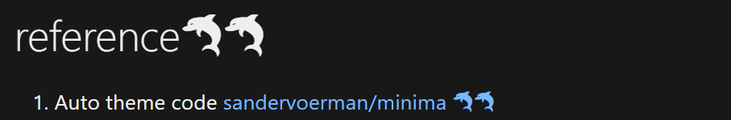

I have a page with emoji characters, such as 🐬

- they lose their color in edge/chrome browsers in windows system as below. they just follow the font color style defined for the page fonts.
    >
    >

- but they still look good in firefox in any system, and also ok in browsers of android system. 
    >
    >

via searching over the network, i find there are a lot of complaints on the emoji character compliance . Fortunately, I find my issue can be fixed by adjusting the css of the page theme [jekyll/minima](https://github.com/jekyll/minima).

The change is very simple:

- check the font family definition in `style.css` file, make sure the `Segoe UI Emoji` is before `Segoe UI Symbol` in definition list.

more details:

- the current theme is using the following font definition:
    ```
    font:400 16px/1.5 -apple-system,system-ui,BlinkMacSystemFont,"Segoe UI","Segoe UI Symbol","Segoe UI Emoji", "Apple Color Emoji",Roboto,Helvetica,Arial,sans-serif;
    ```

- just change it to
    ```
    font:400 16px/1.5 -apple-system,system-ui,BlinkMacSystemFont,"Segoe UI","Segoe UI Emoji","Segoe UI Symbol","Apple Color Emoji",Roboto,Helvetica,Arial,sans-serif;
    ```

---

[⏮ home](../index.md) &nbsp; &nbsp; &nbsp; &nbsp; [🔀 category](../category.md) &nbsp; &nbsp; &nbsp; &nbsp; [◀️ prev](./2022-05-02-make-minima-perfect.md) &nbsp; &nbsp; &nbsp; &nbsp; [▶️ next]()

---
