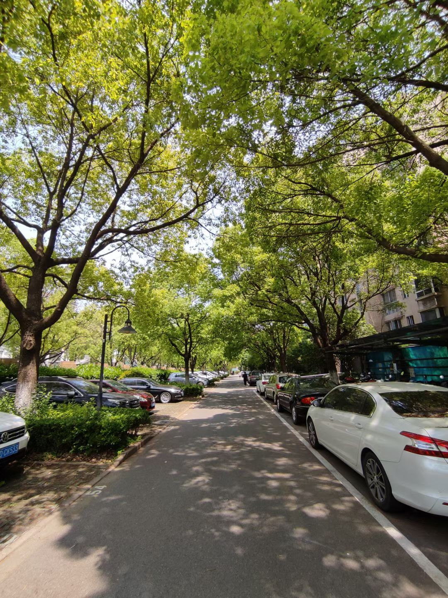
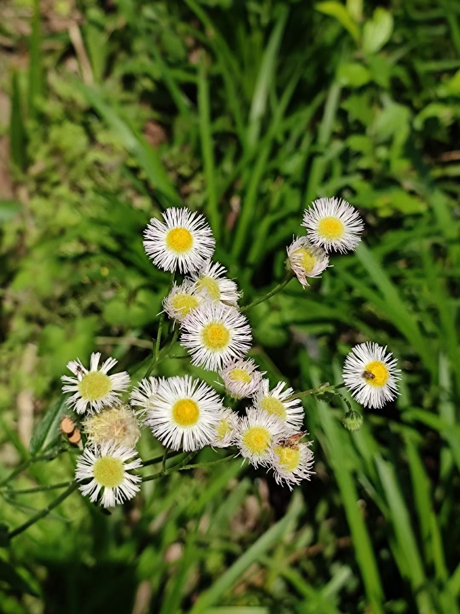
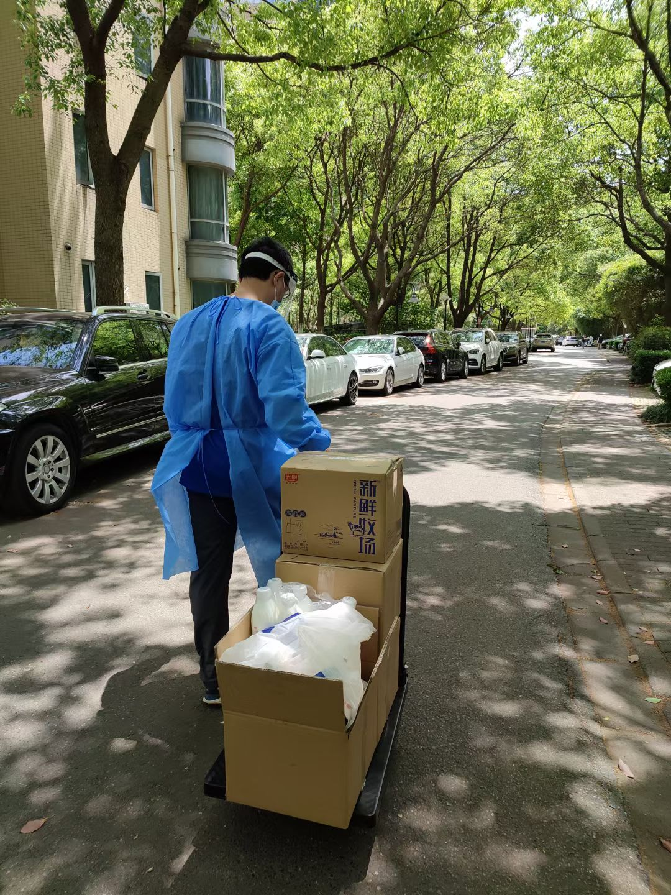
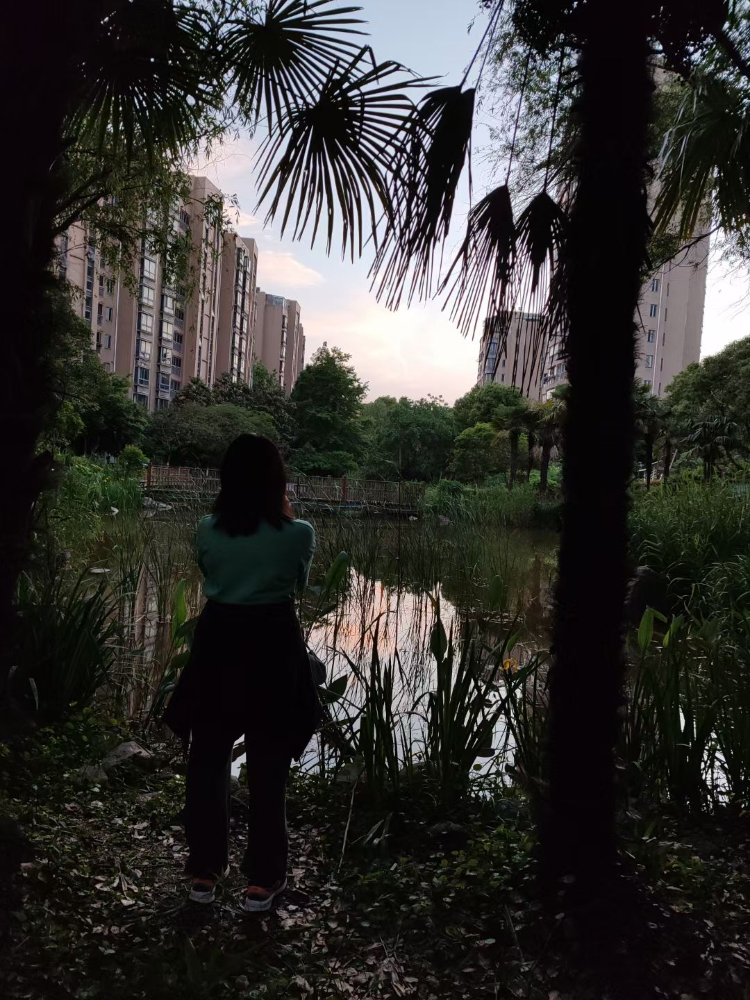
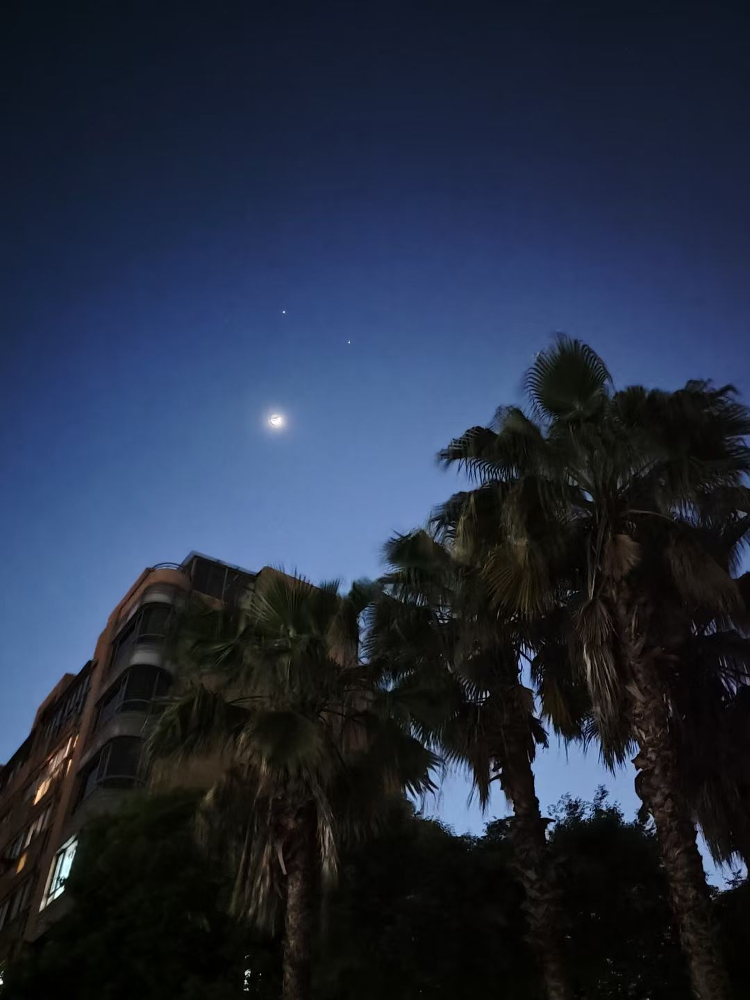

五一已过，初夏来临。天气温度还没升高，但是阳光已经明晃晃的, 中午的时候无法睁眼

{: width="300"}
{: width="300"}

最近总是感觉疲惫，情绪不高，胃口确是不错。吃过早饭，后面又忍不住吃了几小盒奥利奥，然后桔子，两个苹果。看样子是需要多巴胺，正确的打开方式，应该是运动，而不是吃。

上午运了一下楼里的牛奶，睡过一个午觉以后。下午和老婆出去慢跑了一个小时的步, 拍了拍晚霞，心情好了很多。

{: width="300"}
{: width="300"}

初夏的夜空仍然有耀眼闪烁的天狼和猎户座，不过，我们很快就会和他们告别。大角星在东方的天空已经出现。

昨夜双子在月亮旁边，在墨蓝色天空上画了一张静默的脸
{: width="600"}

---

[⏮ home](../index.md) &nbsp; &nbsp; &nbsp; &nbsp; [🔀 category](../category.md) &nbsp; &nbsp; &nbsp; &nbsp; [◀️ prev](./2022-05-08-vscode-line-feed.md) &nbsp; &nbsp; &nbsp; &nbsp; [▶️ next]()

---
