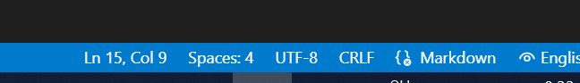
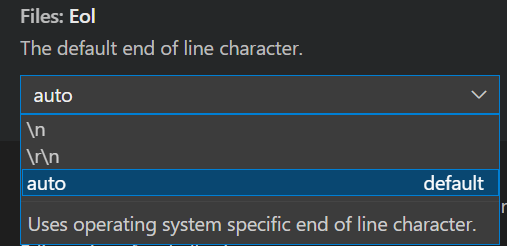

在写[连接Github](./2022-05-08-github-connection.md)这篇笔记的时候，我是直接在github上点<kbd>.</kbd>调用online vscode进行编辑提交的。结果，index page上出现的简介(excerpt)竟然全文而不是第一段文字。
搜索原因，发现有两点:
1) jekyll缺省识别excerpt的识别符是`\n\n`。所以一段文字后跟一个空行，即被识别为excerpt
2) online vscode最终提交给jekyll是换行符是CRLF `\r\n`.这样的话，不满足条件1，整篇文章被做成简介发布在 index上了。

解决方案很简单。在vscode点击一下CRLF模式，改成LF模式，重新发布一下就可以了。

{: width="600"}

唯一不解之谜是我本地的Vscode显示我所有的的markdown 文件都是CRLF模式的。唯一特殊的地方是Files:Eol
{: width="300"}. 

难道vscode push的时候会自动更改LF/CRLF ？

---

[⏮ home](../index.md) &nbsp; &nbsp; &nbsp; &nbsp; [🔀 category](../category.md) &nbsp; &nbsp; &nbsp; &nbsp; [◀️ prev](./2022-05-08-github-connection.md) &nbsp; &nbsp; &nbsp; &nbsp; [▶️ next]()

---
