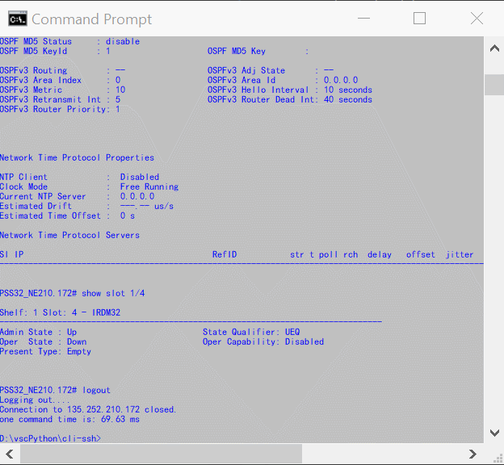

这两三天内做的一件有意义的事情，那就是我搞明白了 [pexpect](https://pexpect.readthedocs.io/en/stable/) 模块几个参数的意义，尝试在 windows 上做了一个 script ，畅通无阻: 自动登录网元，发一堆命令，取得参数，然后自动LOG. 在 IDLE/cmd/powershell/Git bash 运行下来也并没有特别的差异. 调通下来，感觉很爽 🆒

{: width="300"}

做这个事情的初衷来源于上两个星期的一个软件问题。网管找我抱怨说有一个光开光的命令下发以后，3秒后才有相应的信息报出。我去看后，发现现象不像描述的那么简单。于是加间隔 sleep 调试，精确的定位一下网元的反应时间，揣摩一下行为。结果发现[MOBA XTERM](https://mobaxterm.mobatek.net) 的脚本制作方式非常初级，竟然不支持直接读取定制文本，必须手工通过它的界面一条条的加。于是我忍了，一条条的加下来了。 把这个事情完成后，开始打算做一个随时能用的搭建脚本工具。

### 对expect工具的要求:

- 我最在乎的一点是，我能方便地看到**整个交互过程**，就像我在旁边观察一个人在用一个terminal工具，这样才方便调试复杂命令交互情况下的脚本。pexpect 通过`logfile_read=sys.stdout`参数赋值直接打印到屏幕上, 同时可以顺手`logfile=open('logfile.txt','w', encoding='utf-8')` 把log（带回显）保存到文本里。在windows平台上它虽然缺乏一个interact()函数随时让用户介入，但已经很好用了。

- 每次交互，需要**清晰地**拿到这次交互所有的output,供我用正则表达式提取里面的参数。

- 下一次交互的时候，不能再留有上次的抓到的数据，**只能是正在进行交互的数据**。不然这样上次交流的garbage累积变多,后面expect出问题难度加大。

### pexepect 参数:

- 发出命令以后，接收到的数据放立刻存在在一个内部缓存里，这个内部缓存没有给参量名字。
    
    ⚠这个缓存与 pexepect.buffer 没有直接关系。

    📝read()/readlines()/readline() 可以读取这个缓存内容，但是他们分别以EOF/EOF/`\r\n`作为match,对于一个正在交互的命令程序,这三个函数最终都会触发timeout，用于调试可以，用于正常交互，问题多多. 一个可以应用的例外，就是用于读取一次交互就close的进程，read()倒是方便，交互完后本身就是EOF。

- expect(提示符)以后，如果能match上则被触发，read内容会被清空转移，那么pexpect里才更新三个参数，同时更新logfile: 
    - `before` : 提示符之前的抓到的数据，是我们抓取的主要数据 
    - `after`: 就是提示符号自身. `match`是一个class,对应这个`after`这个字符串
    - `buffer`: 如果match了以后，后面还有数据字符进来，这个buffer就是存后面的这个数据。 举例: output `ABCDEFGH`, 如果expect `EF`,那么结果就是before=`ABCD`,after=`EF`, buffer=`GH`;在这个举例里，buffer有残留数据，实际要尽量避免。尽量用`GH`来expect,这样buffer是空。
- 如果是EOF，buffer也会是空的, 无论match与否，read内容 (更新到EOF前的数据)会转到 before会。

- 但如果是**TIMEOUT**,无论match与否， before不会更新，read内容会移入buffer,留待下次expect.

实现的注意点:

- 每次expect 提示符之后，除了TIMEOUT等异常，需要检查一下buffer是否为空。如果不是空，则要查一下原因，给出LOG警示

- 清空buffer,直接赋值`child.buffer=''`是不生效的，下一次expect就会发现，这个buffer内容还是加回来了。需要清空buffer时候，用`child.expect_exact(child.buffer)`
    ```python
    if child.buffer !='':
    print(f"clear the garbage from {child.buffer} to {child.expect_exact(child.buffer)}")
    ```
绘图表示这个关系，如下

<div class='mermaid'>

flowchart LR;

input("input")
plus(("+"))
buffer("buffer")
minus(("-"))
before("before")
after("after")

input-->plus-->buffer-->minus--"match or eof"-->before --> after 
minus--"only_one_time"-->logfile

expect((expect))-->minus & plus
</div>

### 附录

#### windows openssh 与 plink.exe

openssh 用于pexpect需要用`-t -t`强制成pty
`ssh -t -t admin@192.168.1.1`
ssh的密码的stdin处理很特殊，所以pexpect无法捕获，不能用expect`('assword:')`方式输入，只能让用户自己输入。

[plink.exe](https://www.chiark.greenend.org.uk/~sgtatham/putty/latest.html)能解决ssh输入密码问题，如 [`plink -ssh root@192.168.1.1 -P 5122 -pw Asdf#123 -batch`](https://documentation.help/PuTTY/plink-usage.html) 直接输入密码，或者通过交互方式输入密码都可以

#### ANSI Escape字符问题

有些网络设备命令行结果带Escape字符，比如 `\x1b[?7h` [?7h之类，显示颜色，或者自动换行。

windows中 cmd/powershell处理显示escape字符时候，会主动处理。

plink不处理。如果需要显示正常一点，则需要打开windows VirtualTerminalLevel 就可以了。
`reg add HKCU\Console /v VirtualTerminalLevel /t REG_DWORD /d 1`

无论显示怎样，pexpect做为一个pty(伪终端)不会处理，所以logfile里还是有Escape字符。看到这些字符，不要惊讶以为是乱码就是了。logfile可以过滤这些字符。不过必要性不高。

#### Unicode, Ascii, UTF-8

Unicode 两个byte对应一个字，支持所有英文及非英文字符。不兼容ascii码。

Ascii 一个byte对应一个字，只支持英文字符

UTF-8 兼容Ascii(一个byte对应一个英文字符)，对于非英文字符，用三个byte,甚至4个byte来处理。
文件存取时，采用UTF-8来处理。


---

[⏮ home](../index.md) &nbsp; &nbsp; &nbsp; &nbsp; [🔀 category](../category.md) &nbsp; &nbsp; &nbsp; &nbsp; [◀️ prev](2022-05-14-pexpect-paramiko-asynchssh.md) &nbsp; &nbsp; &nbsp; &nbsp; [▶️ next](./2022-05-21-one-day.md)

---
