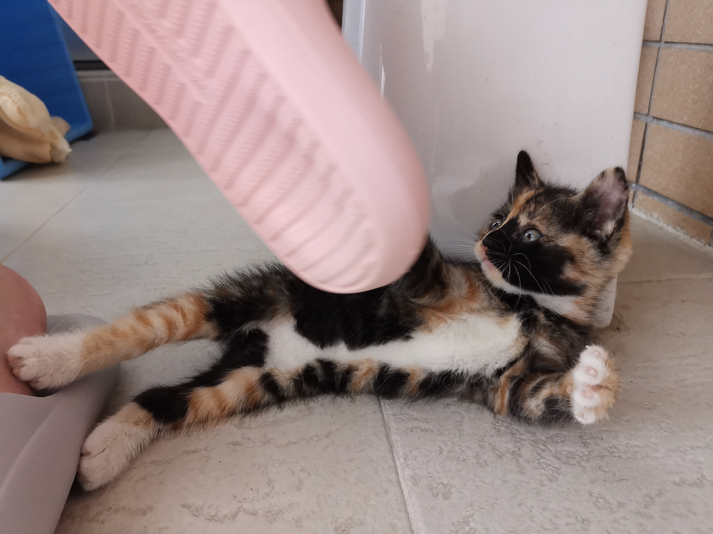
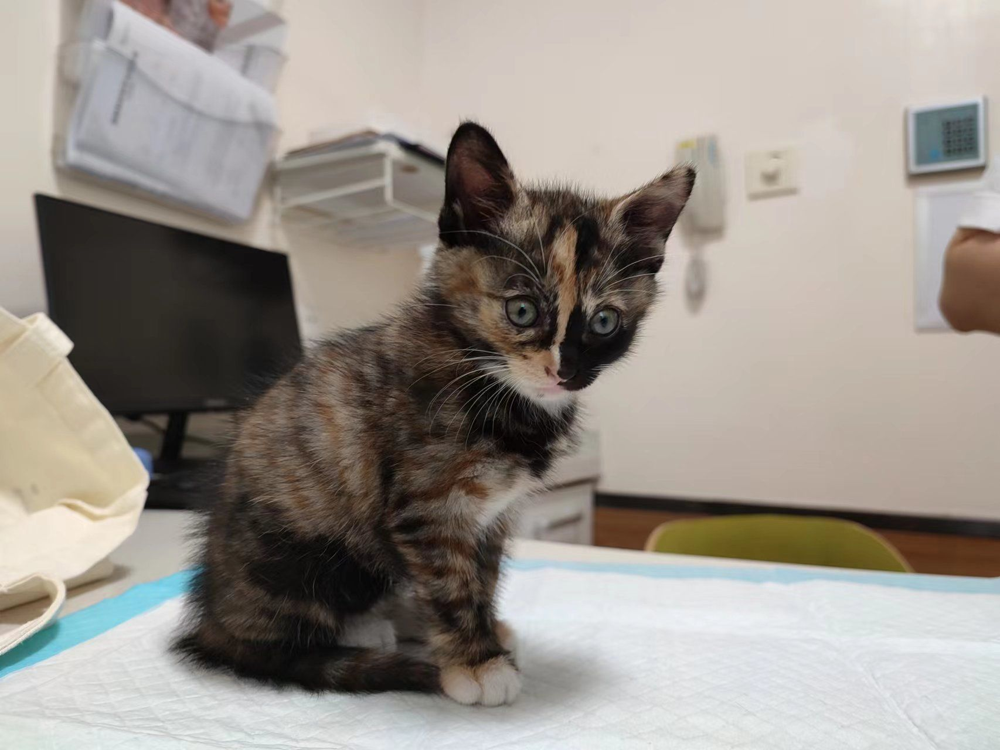
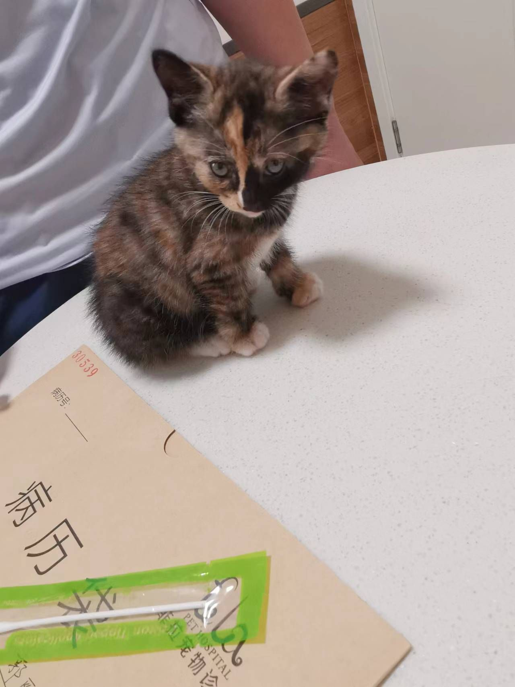
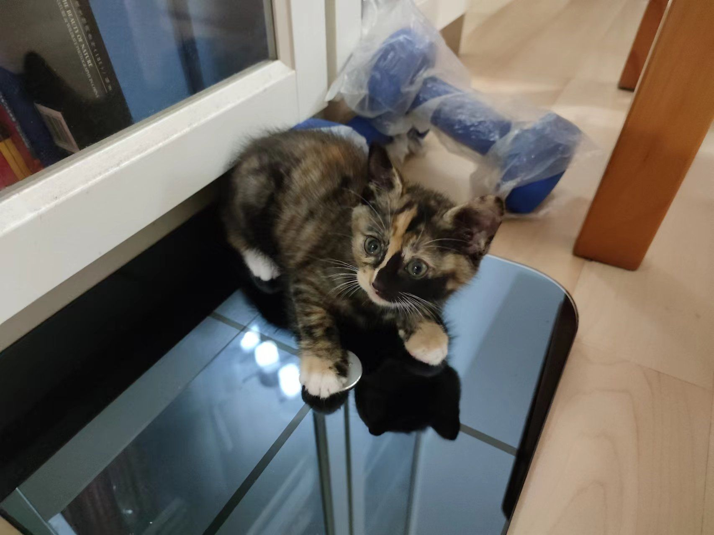
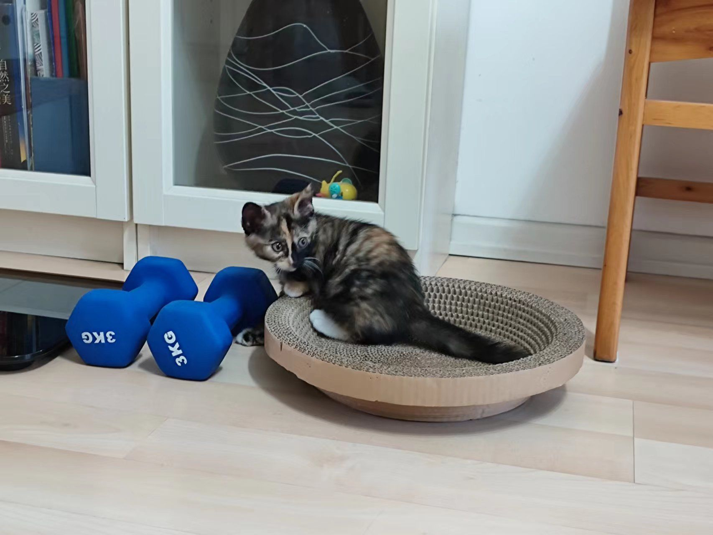
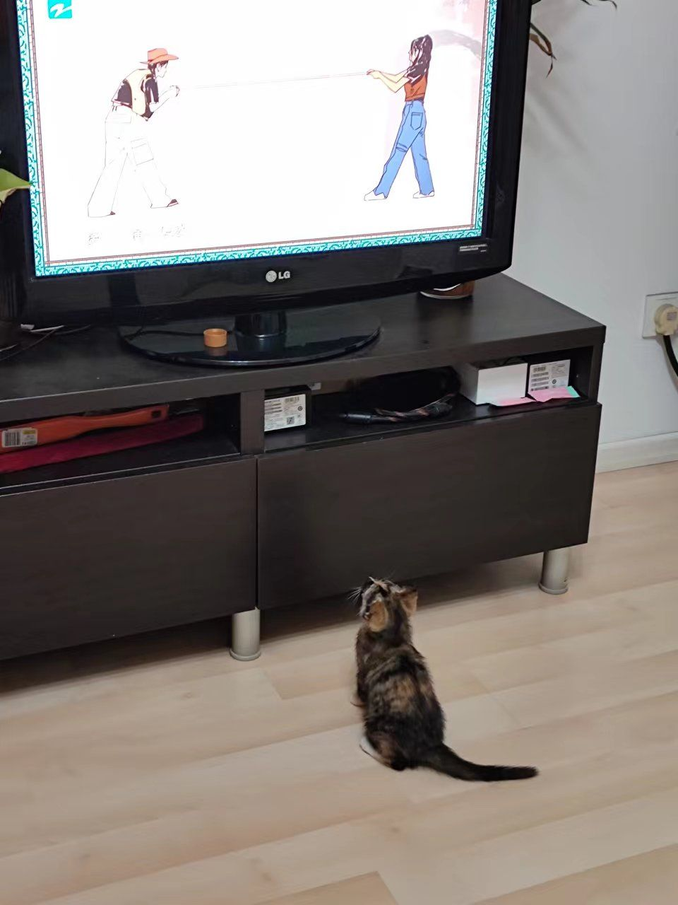

疫情期间7月初在楼门口救了一只小猫，一个多月的样子，刚来的时候，全身都是虱子，被咬的很厉害。热心的爱猫邻居帮着洗了澡，除去虱子。我们打算养下来，给她起名叫咖啡。
咖啡熟悉了环境，驱虫以后，身体也壮了，变得活泼好动起来。
{: width="600"}

咖啡是一个有个性的小猫：
- 咖啡反而不喜欢它熟悉的人摸它，除了吃饭的时候。她吃饭特别专注，只有这个时候，可以摸。但我们主要趁这个时候给她擦屁股，擦一下身子；
- 但如果是生人，那么她立刻变呆萌状，随便摆弄
- 我们给它剪指甲，它会死命反抗，只有去诊所的时候，让医生帮她剪指甲。
- 想带她出去玩，给她戴一个牵引绳，发现她要疯了，和背后的背带誓死搏斗，也只好作罢。
- 背她出去玩，发现也很难。她在猫包里，恐慌的不行。难道她打算在一个屋子里这么待一辈子吗？
- 咖啡很有韧性。为了让她驯顺一点，规定她不上沙发，于是我和她每天在沙发上斗智斗勇。后来，我发现了浇花的洒水器对她很有震慑作用，于是争斗告一段落。咖啡在沙发边上逡巡的时候，看到我，就放弃了。

和它生活了一个多月，产生了不少矛盾。和咖啡无关。咖啡表现的是一个正常小狸花猫的活泼和调皮，我没有这个心理准备，感觉精疲力竭，对她的爱很有限。也无法想象它会在一个小屋里，等到一岁的时候，给她去做绝育手术，然后就这么吃了睡，睡了吃的过一生。
于是，咖啡送给邻居介绍的女儿的同学的一家人了。
咖啡被接走的一天，没有管她。她上了沙发，欢快的打滚，最后累的沙发睡了一觉。 我坐到她身边，她沙发醒来以后，看到我，觉得不可思议。于是龇牙想我俯冲过来，到我身边后，然后嘎然而止。原来是做压力测试，我当作毫不在意的样子，没理她。她又在我身后慢慢走着挤过去，转身看着我，确认我是否恼怒。发现，毫无反应后，确认了自己的扩大的领地，但是疑惑的跳下沙发。
接咖啡的是一对害羞的兄妹。咖啡上车的一霎那，透着猫包，看着我们，恐慌喵的叫了一长声。

后面听说咖啡很快熟悉了新的环境。希望咖啡快乐。
我们也不会再养小猫了， 除非以后，我们有一个带院子的房子。

{: width="300"}
{: width="300"}
{: width="300"}
{: width="300"}
{: width="300"}
{: width="300"}

---

[⏮ home](../index.md) &nbsp; &nbsp; &nbsp; &nbsp; [🔀 category](../category.md) &nbsp; &nbsp; &nbsp; &nbsp; [◀️ prev]() &nbsp; &nbsp; &nbsp; &nbsp; [▶️ next]()

---
