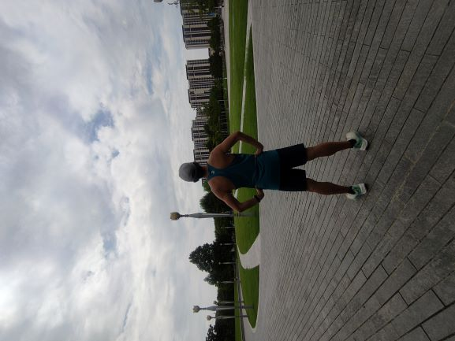
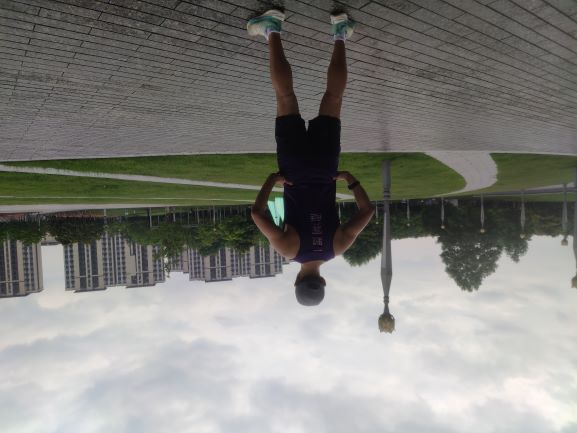

过了两年，我又开始更新我的DailyNote了 🤣

今天周日，早晨阴天，温度在六点也就是30度。已经是很难得的适合跑步的天气了。
5点爬起来，洗漱并且简单的吃了点麦片，然后就去闵行文化公园了
{: width="300"}
{: width="300"}

28度以上的天气，跑15公里以上都比较吃力。现在的心态是苟着跑：跑步不要太注意压低心率，开始先舒展着慢跑，跑不动就走500米或者1公里，苟着跑。

今天跑到10公里/14公里/21公里/27公里处，喝矿泉水/电解质水/果汁，前三处还走了一会，特别是21公里处至少走了8分钟. 一共补充了2000毫升水。一小时平均一瓶水(500ml)

跑完后，天气还在32度，真不错。最近37度的天气也跑过，8公里处就走路了。回来已近中午，直接吃了一份河南捞面，和一份凉菜. 

最近跑步的心得体会，记录如下

- 跑姿，胸不要太挺，不要阻碍腹式呼吸 跑步专注吸，大口吐气，
- 不听音乐。除了练速度间歇听180步频音乐，慢跑以后不听音乐。
- 跑步迈大腿，让小腿按惯性自然折叠

想着两周后的六盘水半马，不知道啥情况。
{:width="300"}

对比一个月前的我，感觉瘦了

{:width="300"}

---

[⏮ home](../index.md) &nbsp; &nbsp; &nbsp; &nbsp; [🔀 category](../category.md) &nbsp; &nbsp; &nbsp; &nbsp; [◀️ prev](2022-09-11-display-27-inch.md) &nbsp; &nbsp; &nbsp; &nbsp; [▶️ next]()

---
